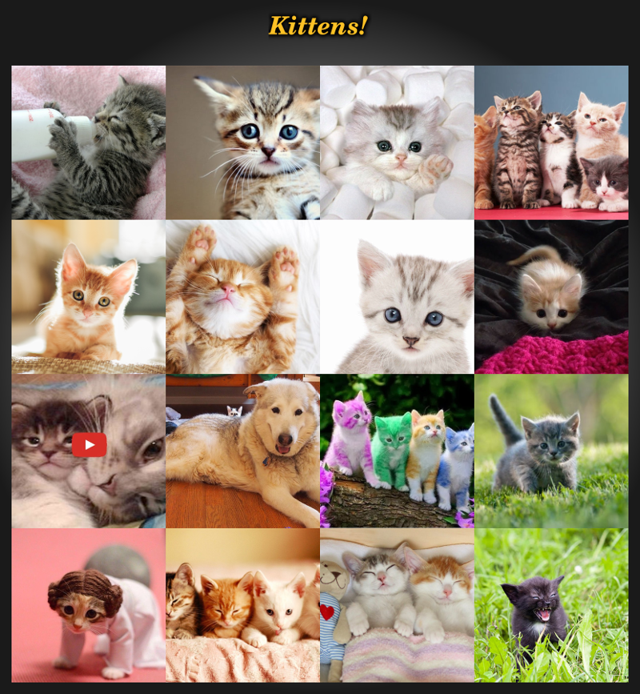
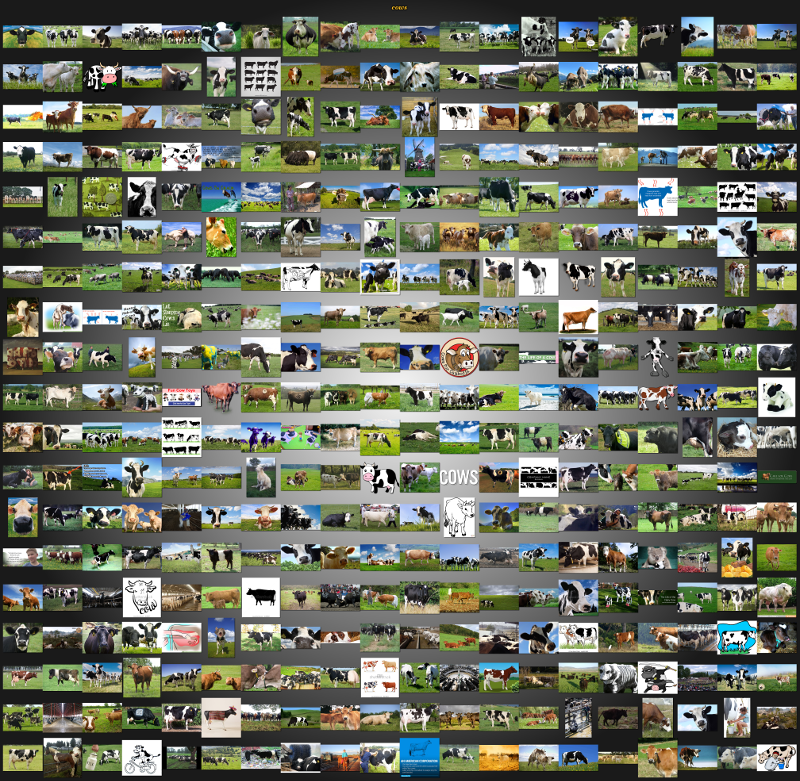

 googliser.sh
---
This is a **[BASH](https://en.wikipedia.org/wiki/Bash_\(Unix_shell\))** script to perform fast image downloads sourced from **[Google Images](https://www.google.com/imghp?hl=en)** based on a specified search-phrase. It's a web-page scraper that feeds a list of original image URLs to [Wget](https://en.wikipedia.org/wiki/Wget) (or [cURL](https://github.com/curl/curl)) to download images in parallel, then combine them using ImageMagick's [montage](http://www.imagemagick.org/Usage/montage/#montage) into a single gallery image. The idea is to build a picture of a phrase.

This is an expansion upon a solution provided by [ShellFish](https://stackoverflow.com/questions/27909521/download-images-from-google-with-command-line) and has been updated to handle Google's various page-code changes from April 2016 to the present.

Big thanks to [dardo82](https://gist.github.com/dardo82/567eac882b678badfd097bae501b64e2) and [stevemart](https://github.com/stevemart) for their work on macOS compatibility. Their mods have been incorporated into this script.

---
##  Installation

    $ wget -qN git.io/googliser.sh && chmod +x googliser.sh

or use:

    $ curl -skLO git.io/googliser.sh && chmod +x googliser.sh

---
##  Workflow

1. The user supplies a search-phrase and other optional parameters on the command-line.

2. A sub-directory with the name of this search-phrase is created below the current directory.

3. [Google Images](https://www.google.com/imghp?hl=en) is queried and the results saved.

4. The results are parsed and all image links are extracted and saved to a URL list file. Any links for **YouTube** and **Vimeo** are removed.

5. The script iterates through this URL list and downloads the first [**n**]umber of available images. Up to **1,000** images can be requested. Up to 512 images can be downloaded in parallel (concurrently). If an image is unavailable, it's skipped and downloading continues until the required number of images have been downloaded or the download failure-limit is reached.

6. Lastly, a thumbnail gallery image is built using ImageMagick's [montage](http://www.imagemagick.org) into a [PNG](https://en.wikipedia.org/wiki/Portable_Network_Graphics) file (see below for examples).

---
##  Compatibility

**googliser** is fully supported on Fedora Workstation, Manjaro & Ubuntu. Debian and macOS may require some extra binaries. Please advise of any issues.

Debian:

    $ sudo apt install wget imagemagick

macOS:

    $ xcode-select --install
    $ ruby -e "$(curl -fsSL git.io/get-brew)"
    $ brew install coreutils ghostscript gnu-sed imagemagick gnu-getopt

---
##  Outputs

These sample images have been scaled down for easier distribution.

    $ ./googliser.sh --phrase "puppies" --title 'Puppies!' --number 25 --upper-size 100000 --lower-size 2000 --failures 0

    $ ./googliser.sh -p "kittens" -T 'Kittens!' -f0 -SC

    $ ./googliser.sh -n 380 -p "cows" -u 250000 -l 10000 -f 0 -S

---
##  Usage

    $ ./googliser.sh [PARAMETERS] ...

Allowable parameters are indicated with a hyphen then a single character or the long form with 2 hypens and full-text. Single character options can be concatenated. e.g. `-CdDhLNqsSz`. Parameters can be specified as follows:

***Required:***

`-p` or `--phrase [STRING]`
The search-phrase to look for. Enclose whitespace in quotes e.g. `--phrase "small brown cows"`

***Optional:***

`--always-download`
Download images, even if number of original image links is less than requested.

`-a` or `--aspect-ratio [PRESET]`
The shape of the image to download. Preset values are:

- `tall`
- `square`
- `wide`
- `panoramic`

`-b` or `--border-thickness [INTEGER]`
Thickness of border surrounding the generated gallery image in pixels. Default is 30. Enter 0 for no border.

`-C` or `--condensed`
Create the gallery in condensed mode. No padding between each thumbnail.

`-d` or `--debug`
Put the debug log into the image sub-directory afterward. If selected, debugging output is appended to '**debug.log**' in the image sub-directory. This file is always created in the temporary build directory. Great for finding out what external commands and parameters were used!

`-D` or `--delete-after`
Delete the downloaded images after building the thumbnail gallery. Umm, don't specify this and `--no-gallery` at the same time.

`--exclude [FILE]`
Any previously downloaded URLs will be saved into this file (if specified). Specify this file again for future searches to ensure the same links are not reused.

`-f` or `--failures [INTEGER]`
How many download failures before exiting? Default is 32. Enter 0 for unlimited (this can potentially try to download every result, so only use this if you've previously had a lot of failures).

`--format [PRESET]`
Image format to download. Preset values are:

- `jpg`
- `png`
- `gif`
- `bmp`
- `svg`
- `webp`
- `ico`
- `craw`

`-h` or `--help`
Display this help then exit.

`-i` or `--input [FILE]`
Put your search phrases into a text file then specify the file here. **googliser** will download images matching each phrase in the file, ignoring any line starting with a `#`.

`-l` or `--lower-size [INTEGER]`
Only download image files larger than this many bytes. Some servers do not report a byte file-size, so these will be downloaded anyway and checked afterward (unless `--skip-no-size` is specified). Default is 1,000 bytes. I've found this setting useful for skipping files sent by servers that give me HTML instead of the JPG I requested. 

`-L` or `--links-only`
Only get image file URLs. Don't download any images.

`-m` or `--minimum-pixels [PRESET]`
Only download images with at least this many pixels. Preset values are:

- `qsvga` (400 x 300)
- `vga`   (640 x 480)
- `svga`  (800 x 600)
- `xga`  (1024 x 768)
- `2mp`   (1600 x 1200)
- `4mp`   (2272 x 1704)
- `6mp`   (2816 x 2112)
- `8mp`   (3264 x 2448)
- `10mp`  (3648 x 2736)
- `12mp`  (4096 x 3072)
- `15mp`  (4480 x 3360)
- `20mp`  (5120 x 3840)
- `40mp`  (7216 x 5412)
- `70mp`  (9600 x 7200)
- `large`
- `medium`
- `icon`

`-n` or `--number [INTEGER]`
Number of images to download. Default is 16. Maximum is 1,000.

`--no-colour` or `--no-color`
Runtime display in bland, uncoloured text.

`-N` or `--no-gallery`
Don't create a thumbnail gallery. Err, don't specify this and `--delete-after` at the same time.

`-o` or `--output [PATH]`
The output directory. If unspecified, the search phrase is used. Enclose whitespace in quotes.

`-P` or `--parallel [INTEGER]`
How many parallel image downloads? Default is 64. Maximum is 512.

`-q` or `--quiet`
Suppress standard display output. Error messages are still shown.

`--random`
Download a single random image. Use `-n --number` to set the size of the image pool to pick a random image from.

`-r` or `--retries [INTEGER]`
Number of download retries for each image. Default is 3. Maximum is 100.

`-R` or `--recent [PRESET]`
Only get images published this far back in time. Default is any. Preset values are:

- `any`
- `hour`
- `day`
- `week`
- `month`
- `year`

`-s` or `--save-links`
Put the URL results file into the image sub-directory afterward. If selected, the URL list will be found in '**download.links.list**' in the image sub-directory. This file is always created in the temporary build directory.

`-S` or `--skip-no-size`
Some servers do not report a byte file-size, so this parameter will ensure these image files are not downloaded. Specifying this will speed up downloading but will generate more failures.

`--thumbnails [STRING]`
Specify the maximum dimensions of thumbnails used in the gallery image. Width-by-height in pixels. Default is 400x400. If also using condensed-mode `-C --condensed`, this setting determines the size and shape of each thumbnail. Specify like `--thumbnails 200x150`.

`-t` or `--timeout [INTEGER]`
Number of seconds before Wget gives up. Default is 30. Maximum is 600 (10 minutes).

`-T` or `--title [STRING]`
Specify a custom title for the gallery. Default is to use the search-phrase. To create a gallery with no title, specify `--title false`. Enclose whitespace in single or double-quotes according to taste. e.g. `--title 'This is what cows look like!'`

`--type [PRESET]`
Image type to download. Preset values are:

- `face`
- `photo`
- `clipart`
- `lineart`
- `animated`

`-u` or `--upper-size [INTEGER]`
Only download image files smaller than this many bytes. Some servers do not report a byte file-size, so these will be downloaded anyway and checked afterward (unless `--skip-no-size` is specified). Default is 0 (unlimited).

`--usage-rights [PRESET]`
Usage rights. Preset values are:

- `reuse` (labeled for reuse)
- `reuse-with-mod` (labeled for reuse with modification)
- `noncomm-reuse` (labeled for noncommercial reuse)
- `noncomm-reuse-with-mod` (labeled for noncommercial reuse with modification)

`-z` or `--lightning`
Lightning mode! For those who really can't wait! Lightning mode downloads images even faster by using an optimized set of parameters: timeouts are reduced to 1 second, don't retry any download, skip any image when the server won't tell us how big it is, download up to 512 images at the same time, and don't create a gallery afterward.

**Usage Examples:**

    $ ./googliser.sh -p "cows"

This will download the first 16 available images for the search-phrase *"cows"*

    $ ./googliser.sh --number 250 --phrase "kittens" --parallel 128 --failures 0

This will download the first 250 available images for the search-phrase *"kittens"*, download up to 128 images at once and ignore the failures limit.

    $ ./googliser.sh --number 56 --phrase "fish" --upper-size 50000 --lower-size 2000 --failures 0 --debug

This will download the first 56 available images for the search-phrase *"fish"* but only if the image files are between 2KB and 50KB in size, ignore the failures limit and write a debug file.

    $ ./googliser.sh -n80 -p "storm clouds" -sN --debug

This will download the first 80 available images for the phrase *"storm clouds"*, ensure both debug and URL links files are placed in the target directory and won't create a thumbnail gallery.

---
##  Return Values ($?)

0 : success!  
1 : required external program unavailable.  
2 : specified parameter incorrect - help shown.  
3 : unable to create sub-directory for 'search-phrase'.  
4 : could not get a list of search results from Google.  
5 : image download aborted as failure-limit was reached or ran out of images.  
6 : thumbnail gallery build failed.  
7 : unable to create a temporary build directory.

---
##  Notes

- I wrote this script so users don't need to obtain an API key from Google to download multiple images.

- The downloader prefers to use [GNU Wget](https://en.wikipedia.org/wiki/Wget) but can also use [cURL](https://github.com/curl/curl) if it's available.

- To download 1,000 images, you need to be lucky enough for Google to find 1,000 results for your search term, and for those images to be available for download. I sometimes get more failed downloads than successful downloads (depending on what I'm searching for). In practice, I've never actually had Google return 1,000 results. Best was about 986.

- Only [PNG](https://en.wikipedia.org/wiki/Portable_Network_Graphics), [JPG](https://en.wikipedia.org/wiki/JPEG) (& [JPEG](https://en.wikipedia.org/wiki/JPEG)), [GIF](https://en.wikipedia.org/wiki/GIF), [BMP](https://en.wikipedia.org/wiki/BMP_file_format), [ICO](https://en.wikipedia.org/wiki/ICO_(file_format)) and [WebP](https://en.wikipedia.org/wiki/WebP) files are available for download.

- If **identify** (from ImageMagick) is installed, every downloaded file is checked to ensure that it is actually an image. Every file is renamed according to the image type determined by **identify**. If **identify** is not available, then no type-checking occurs.

- Every link that cannot be downloaded, or is outside the specified byte-size range, counts as a 'failure'. A good way to see lots of failures quickly is to specify a narrow byte-size range. e.g. `--lower-size 12000 --upper-size 13000`.

- The failures percentage shown after download is the number of failed downloads as a percentage of the total number of image downloads attempted - this includes successful downloads. e.g. 25 images downloaded OK with 8 download failures yields a total of 33 downloads attempted. And 8 / 33 = **24%**.

- The final search results count is determined by adding together the number of images required (default is 16) with the number of allowable failures (default is 32). Search results initially download in groups of 100. So, for the defaults shown, the script downloads the first group of 100. Then trims it so only the first 48 results remain. Then downloads these as images. Results can be shorter though depending on other factors such as URLs returned with invalid names, Google not sending many results from the requested search, etc... The URL results list is only trimmed after dealing with these issues. The count can also change between searches as Google don't always return the same results - even for identical searches.

- Only the first image of a multi-image file (like an animated **GIF**) will be used for its gallery image.

- Thumbnail gallery building can be disabled if not required by using `--no-gallery`. Why? As a test, I built a gallery from 380 images (totalling 32.6MB) which created a file of 201MB with dimensions of 8,064 x 7,876 (63.5MP). This took **montage** a bit over 20 minutes to render on my old Atom D510 CPU. 

- Typically, downloads run quite fast and then get slower as the required number of images is reached, as less parallel downloads are running (which I'll refer to as download slots). Sometimes downloads will appear to stall, as all the download slots are being held up by servers that are not responding/slow to respond or are downloading very large files. New download slots won't open up until at least one of these completes, fails or times-out. If you download a large enough number of files, all the download slots can end up like this. This is perfectly normal behaviour and the problem will sort itself out. Grab a coffee.

- Sometimes, you may also see a slowdown when downloading the last image (e.g. when something like 24 out of 25 images have downloaded without issue). This leaves only one download slot available to use. However, this slot keeps encountering a series of problem links (as mentioned above) and so can take some time to get that last image as the script works it way through the links list. Grab a danish to go with that coffee. 

- The temporary build directory is `/tmp/googliser.PID.UNIQ` where PID is shown in the title of the script when it runs and UNIQ will be any 3 random alpha-numeric characters.

- This script will need to be updated from time-to-time as Google periodically change their search results page-code. The latest copy can be found **[here](https://github.com/teracow/googliser)**.

---
##  Development Environment

- [Debian](https://www.debian.org/) - *10.0 Buster 64b*
- GNU BASH - *v5.0.3*
- GNU sed - *v4.7*
- GNU grep - *v3.3*
- GNU Wget - *v1.20.1*
- [ImageMagick](http://www.imagemagick.org) - *v6.9.10-23 Q16*
- Geany - *v1.33*
- [ReText](https://github.com/retext-project/retext) - *v7.0.4*
- Konsole - *v18.04.0*
- KDE Development Platform - *v5.54.0*
- QT - *v5.11.3*
- [Find Icons](http://findicons.com/icon/131388/search) - script icon

**Also tested on:**

- [openSUSE](https://www.opensuse.org/) - *LEAP 42.1 64b*
- [Ubuntu](http://www.ubuntu.com/) - *18.04.1 LTS*
- [macOS](https://en.wikipedia.org/wiki/MacOS) - *10.13 High Sierra*, *10.14 Mojave*, *10.15 Catalina*
- [Fedora](https://getfedora.org/) - *28, 30 Workstation*
- [Mint](https://linuxmint.com/) - *19.1 Tessa XFCE*
- [Manjaro](https://manjaro.org/) - *18.0.2 XFCE*

Suggestions / comments / bug reports / advice (are|is) most welcome. :) [email me](mailto:teracow@gmail.com)
